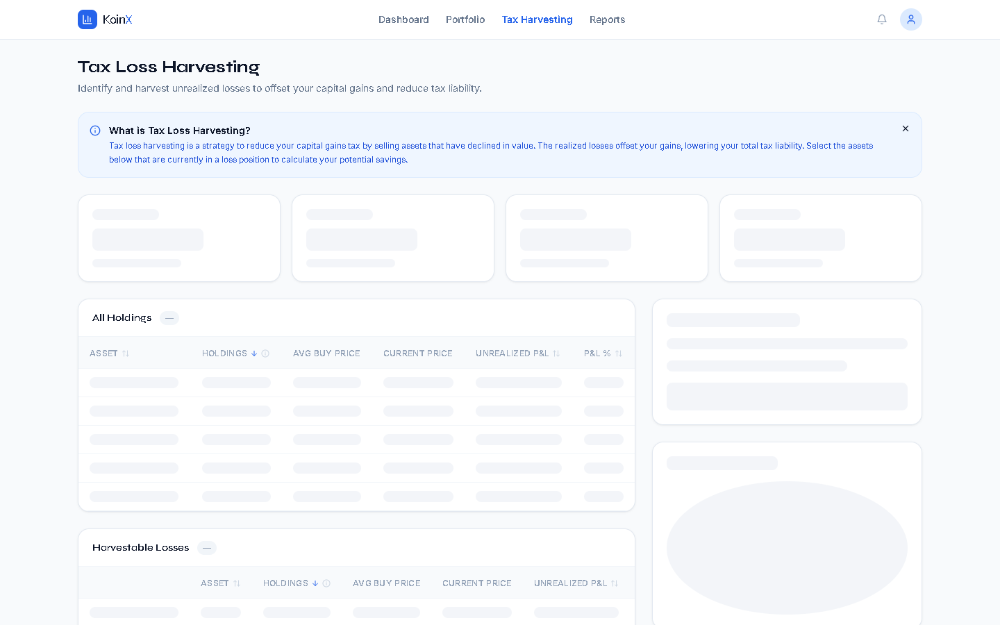
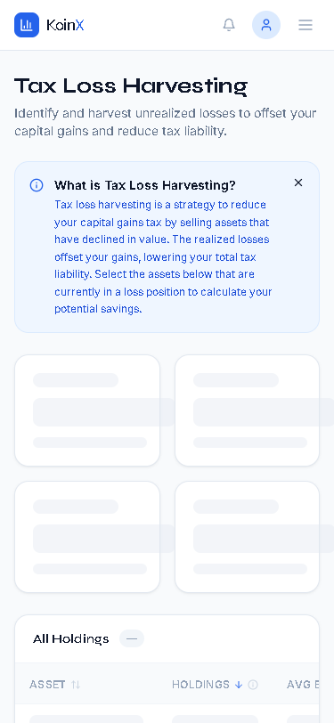

# KoinX — Tax Loss Harvesting Dashboard

A production-grade crypto tax dashboard built for the **KoinX Frontend Intern Assignment**. Simulates real-world tax loss harvesting: analyze your crypto portfolio, identify loss positions, and calculate potential tax savings.

**[Live Demo →](https://koinx-tlh.vercel.app)** _(deploy to Vercel to activate)_



<div align="center">
  
</div>

---

## Features

- **Portfolio Overview** — Total value, unrealized P&L, taxable gains, estimated tax liability
- **Tax Loss Harvesting** — Select loss-position assets to compute before/after tax impact
- **Interactive Holdings Table** — Sortable columns, checkbox selection, mobile-responsive with horizontal scroll
- **Real-time Impact Panel** — Live computation of harvested losses, new tax liability, and savings
- **Portfolio Composition Chart** — Donut chart of allocation by asset
- **Success Modal** — Confirmation of simulated harvest with a summary
- **Loading & Error States** — Skeleton loaders, error fallback with retry
- **Mobile-First Responsive** — Works cleanly on 320px → 1440px+
- **Production Ready** — Strict TypeScript, linted, accessible (WCAG compliant), and optimized for performance.

---

## Tech Stack

| Layer | Choice |
|-------|--------|
| Framework | Next.js 14 (App Router) |
| Language | TypeScript |
| Styling | Tailwind CSS |
| State | Zustand |
| Charts | Recharts |
| UI Primitives | Radix UI (Dialog, Tooltip) |
| Animation | Framer Motion (layout transitions) |
| Icons | Lucide React |
| Fonts | Syne (display) + Inter (body) |

---

## Project Structure

```
koinx-tlh/
├── app/
│   ├── layout.tsx          # Root layout, metadata
│   ├── page.tsx            # Main TLH page (composition root)
│   └── globals.css         # Tailwind base + custom CSS
├── components/
│   ├── ui/                 # Primitive components (Button, Skeleton, PnLBadge, Tooltip, ErrorState)
│   ├── dashboard/          # Feature components (PortfolioSummary, HoldingsTable, PortfolioChart)
│   ├── harvesting/         # Harvesting-specific (HarvestingPanel, HarvestSuccessModal, InfoBanner)
│   └── shared/             # App shell (Navbar)
├── hooks/
│   └── usePortfolioStore.ts # Zustand store — assets, selection, computed getters
├── lib/
│   └── calculations.ts      # Pure business logic (portfolio summary, harvesting math)
├── mock-data/
│   └── portfolio.ts         # 10 realistic crypto assets with buy/current prices
├── types/
│   └── index.ts             # CryptoAsset, PortfolioSummary, HarvestingResult, TaxConfig
└── utils/
    ├── format.ts            # fmt helpers (USD, %, number), cn(), pnlColor()
    └── api.ts               # Async mock API with simulated latency
```

---

## Setup

```bash
# Clone and install
git clone https://github.com/YOUR_USER/koinx-tlh.git
cd koinx-tlh
npm install

# Dev server
npm run dev
# → http://localhost:3000

# Type check
npm run type-check

# Build
npm run build
```

---

## Architecture Decisions

### State: Zustand over Context
Context re-renders the full tree on any state change. Zustand's selector model ensures only subscribed components re-render. The store exposes computed getters (`getSummary`, `getHarvestingResult`) so derived data is never stale.

### Business Logic Separation
All tax math lives in `lib/calculations.ts` as pure functions. Components never compute — they only display. This makes the logic independently testable and easy to audit.

### Mock API Pattern
`utils/api.ts` wraps data in an `async` function with `setTimeout`, simulating real network latency. Swapping to a real API requires only changing this one file.

### Table Responsiveness
Rather than collapsing columns (which loses information density), the table uses horizontal scroll on mobile with a visible scrollbar. A `min-width` on the table container ensures no layout shifting.

### Tax Rate Assumptions
- India crypto tax: flat 30% on all gains (short-term and long-term treated identically)
- 4% cess (health & education surcharge) applied on top
- Effective rate: 31.2%
- No indexation benefit for crypto under Indian IT Act

---

## Tradeoffs

| Decision | Tradeoff |
|----------|----------|
| Zustand (not Context) | Slight bundle size increase; worth it for selector-level re-render control |
| Radix UI primitives | Accessibility + keyboard nav for free; adds ~15KB |
| Recharts | Mature, SSR-safe; D3 would give more control but far more code |
| No React Query | Portfolio is loaded once per session; SWR/RQ overhead not justified for mock data |
| Flat 30% tax rate | Simplification; real India crypto tax has nuances around VDA classification |
