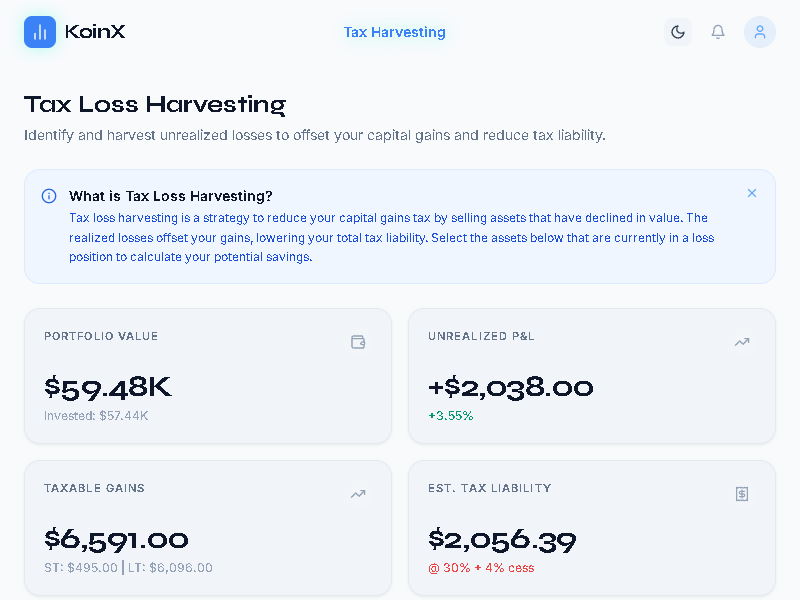
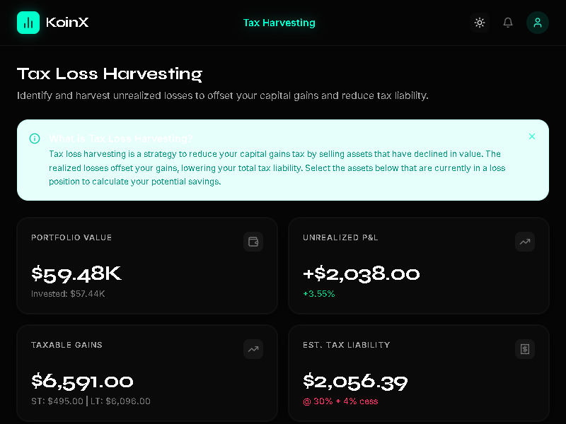

# KoinX - Tax Loss Harvesting Assignment

This repository contains the implementation for the KoinX Frontend Intern Assignment. The objective was to build a responsive and visually appealing **Tax Loss Harvesting Interface**, closely following the provided Figma design, while demonstrating advanced architectural skills in frontend development.

## 🚀 Features

- **Pixel-Perfect Figma Accuracy (Light Mode):** The default theme is rigorously matched to the assignment's Figma design, respecting the KoinX brand guidelines, typography, and spacing.
- **Premium Custom Dark Mode:** Featuring a custom-built, vibrant "Cyber Neon" aesthetic with deep blacks and neon cyan accents. Fully implemented using a dynamic CSS variable architecture via `next-themes` (no flash of unstyled content).
- **Fluid Micro-Interactions:** Enhanced with `framer-motion` to provide buttery-smooth physics-based animations. Table rows cascade into view, and dynamic panels dynamically expand open without rigid snapping.
- **Robust State Management:** Built using `zustand` to manage complex portfolio states, selections, and tax calculations globally, keeping the React component tree clean and decoupled.
- **Fully Responsive:** Optimized for both mobile and desktop viewports, with a mobile-friendly slide-out navigation menu.

## 📸 Previews

### Light Mode (Figma Accurate)


### Dark Mode (Premium Neon Aesthetic)


## 🛠 Tech Stack

- **Framework:** Next.js 14 (App Router)
- **Styling:** Tailwind CSS (Custom variable injection for themes)
- **State Management:** Zustand
- **Animations:** Framer Motion
- **Icons & Primitives:** Lucide React, Radix UI
- **Typography:** Next Fonts (Inter, Syne, JetBrains Mono)
- **Language:** TypeScript

## ⚙️ Running Locally

1. Clone the repository:
   ```bash
   git clone https://github.com/mmaroof487/KoinX-TLH.git
   cd KoinX-TLH
   ```

2. Install dependencies:
   ```bash
   npm install
   ```

3. Run the development server:
   ```bash
   npm run dev
   ```

4. Open [http://localhost:3000](http://localhost:3000) with your browser to see the result.

## 📐 Architecture Highlights

- **Dynamic Theming:** Unlike traditional Tailwind `dark:` classes, this project uses a CSS-variable-first approach. All semantic colors (`bg-surface-50`, `text-ink-900`) reference global CSS tokens that instantly swap HSL values when the `<html class="dark">` attribute is toggled by `next-themes`. This makes the application easily scalable for multiple themes.
- **Decoupled Logic:** The complex loss/gain algorithms and array manipulation are lifted out of the React UI components and managed in isolated store actions (`hooks/usePortfolioStore.ts` and `lib/calculations.ts`), ensuring pure render cycles and easy testability.
- **Accessible Tooltips & Modals:** Leveraging Radix UI to ensure that hover states, popups, and the final "Success" modal maintain strict WAI-ARIA accessibility compliance.
